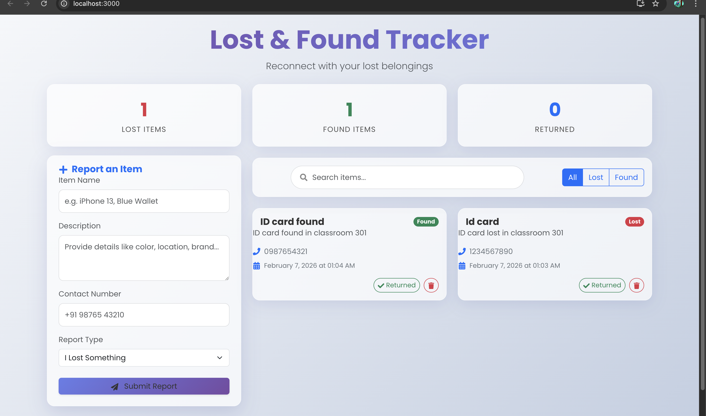

# 🔍 Lost & Found Tracker


A professional full-stack web application designed to help communities report, track, and recover lost items. It features a modern **Glassmorphism UI**, real-time filtering, and a robust RESTful API backend.

---

## 📑 Table of Contents

-   [Features](#-features)
-   [Future Roadmap](#-future-roadmap)
-   [Tech Stack](#-tech-stack)
-   [Project Structure](#-project-structure)
-   [Installation & Setup](#-installation--setup)
    -   [Prerequisites](#prerequisites)
    -   [Backend Setup](#1-backend-setup)
    -   [Frontend Setup](#2-frontend-setup)
-   [API Documentation](#-api-documentation)
-   [Screenshots](#-screenshots)
-   [Contributing](#-contributing)

---

## ✨ Features

-   **Report Items**: Submit details for Lost or Found items.
-   **Smart Filtering**: Toggle between "Lost", "Found", or "All" items instantly.
-   **Search**: Real-time search by item name or description.
-   **Stats Dashboard**: Visual overview of total lost, found, and returned items.
-   **Status Tracking**: Mark items as "Returned" when they are recovered.
-   **Responsive Design**: Mobile-friendly interface with glassmorphism aesthetics.
-   **Modern UI**: Smooth animations, gradients, and professional typography (Poppins).

---

## 🚀 Future Roadmap

We are actively working on making this project internship-ready with the following advanced features:

### 1. 📸 Image Uploads
*Allow users to upload photos of lost or found items.*
-   **Why**: Visual verification increases recovery rates.
-   **Tech**: Multer (Backend), Cloudinary (Storage).

### 2. 🗺️ Interactive Map
*Pin the exact location where an item was lost/found.*
-   **Why**: "Lost at the park" is vague; a map pin is precise.
-   **Tech**: Leaflet.js or Google Maps API.

### 3. 🔐 User Authentication
*Secure login system for managing posts.*
-   **Why**: Prevents spam and allows users to manage their own listings.
-   **Tech**: JWT (JSON Web Tokens), bcrypt.

---

## 🛠 Tech Stack

### Frontend (Client)
-   **React.js**: Functional components with Hooks (`useState`, `useEffect`).
-   **Bootstrap 5**: Responsive grid and layout utilities.
-   **CSS3**: Custom Glassmorphism styles, CSS Variables, Animations.
-   **Axios**: Promise-based HTTP client.
-   **React Icons**: Professional icon set.

### Backend (Server)
-   **Node.js**: JavaScript runtime environment.
-   **Express.js**: Fast, unopinionated web framework.
-   **MongoDB**: NoSQL database for flexible data storage.
-   **Mongoose**: ODM library for MongoDB and Node.js.
-   **Dotenv**: Environment variable management.

---

## 📂 Project Structure

```bash
lost-and-found-tracker/
├── lost-and-found-backend/       # Server-Side Code
│   ├── models/                   # Database Schemas (Item.js)
│   ├── routes/                   # API Endpoints (itemRoutes.js)
│   ├── server.js                 # Entry Point (Express App)
│   ├── package.json              # Backend Dependencies
│   └── .env                      # Secrets (MONGO_URI, PORT)
│
├── lost-and-found-frontend/      # Client-Side Code
│   ├── public/                   # Static Assets (index.html)
│   ├── src/
│   │   ├── components/           # UI Components
│   │   │   ├── ItemCard.js       # Display Card for Items
│   │   │   └── ItemForm.js       # Report Creation Form
│   │   ├── App.js                # Main Logic (State, Routing)
│   │   ├── App.css               # Branding & Glassmorphism Styles
│   │   └── index.js              # React Entry Point
│   ├── package.json              # Frontend Dependencies
│   └── .env                      # Configuration (API URL)
│
└── README.md                     # Project Documentation
```

---

## 💻 Installation & Setup

Follow these steps to run the complete full-stack application.

### Prerequisites
-   **Node.js** (v14+) installed.
-   **MongoDB Atlas** account (or local MongoDB).

### 1. Backend Setup
1.  Navigate to the backend folder:
    ```bash
    cd lost-and-found-backend
    ```
2.  Install dependencies:
    ```bash
    npm install
    ```
3.  Create a `.env` file:
    ```env
    MONGO_URI=your_mongodb_connection_string
    PORT=5001
    ```
    *(Note: Port 5001 is used to avoid conflict with macOS AirPlay).*
4.  Start the server:
    ```bash
    npm start
    ```
    *Output should say: "Server running on port 5001"*

### 2. Frontend Setup
1.  Open a **new terminal** and navigate to the frontend folder:
    ```bash
    cd lost-and-found-frontend
    ```
2.  Install dependencies:
    ```bash
    npm install
    ```
3.  Create a `.env` file:
    ```env
    REACT_APP_API_URL=http://localhost:5001/api/items
    ```
4.  Start the application:
    ```bash
    npm start
    ```
    *The app will open automatically at `http://localhost:3000`.*

---

## 📡 API Documentation

Base URL: `http://localhost:5001/api/items`

| Method | Endpoint | Description | Request Body |
| :--- | :--- | :--- | :--- |
| `GET` | `/` | Get all items | - |
| `POST` | `/` | Create item | `{ name, description, contactNumber, type }` |
| `PUT` | `/:id` | Update status | `{ isReturned: true/false }` |
| `DELETE` | `/:id` | Delete item | - |

---

## 📸 Screenshots



---

## 🤝 Contributing

Contributions are welcome! Please fork the repository and create a pull request.

1.  Fork the Project
2.  Create your Feature Branch (`git checkout -b feature/NewFeature`)
3.  Commit your Changes (`git commit -m 'Add NewFeature'`)
4.  Push to the Branch (`git push origin feature/NewFeature`)
5.  Open a Pull Request
